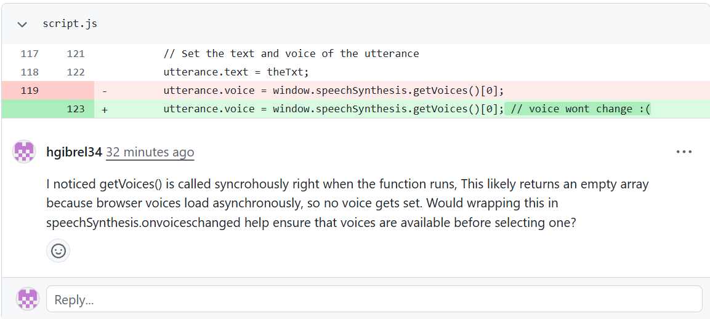

# M3: Peer Code Review

*Formally review code submitted by a peer.*

**Target Skills: Code Review, Feedback Delivery**

## Task

This week's task was to submit a piece of my own code as a GitHub pull request and leave a formal peer code review on my partner's pull request using the Noticed / Wondered / Would-Try (N/W/WT) framework. This framework structures feedback into three parts: what I noticed in the code (observations, no judgment yet), what I wondered about (open questions rather than commands), and what I would try (a suggested next step, framed as an option rather than an instruction). The goal was to practice giving feedback that guides an author toward their own fix rather than just pointing out what's wrong.

## Process

I pushed my AP CSA Java project, a package ordering system built with two classes, to GitHub, created a new branch, and opened a pull request with a description explaining what the code does and what kind of feedback I wanted. For my partner's review, I read through her JavaScript code for a mental health website's "thought diffusion" page. I left four inline N/W/WT comments on specific lines, each noting something concrete I observed, a question it raised for me, and a possible next step. I closed with a summary comment covering what was working well, what I'd prioritize fixing first, and what I wanted to understand better before offering more specific advice.

## Deliverable

My review comments on my partner's pull request are visible at the link above. 

Completed PR: https://github.com/mayastein/dwight/pull/1#pullrequestreview-4587991145

My Inline Comments: 

Summary Comment: 

## Reflection

One thing I noticed about myself as a reviewer is that I'm better at asking questions than giving direct instructions — most of my comments were "I wondered if..." rather than "you should do this," which felt more collaborative. I want to carry that into Module 4 but also push myself to be more direct when I spot a clear issue, instead of softening it too much. The hardest feedback to write was pointing out that `getVoices()` might be the root of the bug, because I wasn't 100% sure I was right and didn't want to mislead my partner. If I did it again I'd probably research the API more before commenting so I could be more confident in what I was saying.
