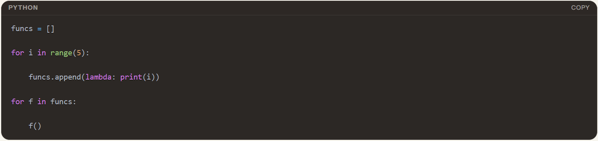

# M4: Questions Only

*Help a friend debug a problem by only asking questions.*

**Target Skills: Constructive Inquiry, Verbal Precision, Accessible Communication**

## Task

This entry uses one of the course's backup practice scenarios (a pre-written debugging problem). In this scenario, Tia, a study-group member, is learning about first-class functions in Python. She writes a loop that creates five small functions (lambdas), each meant to print a different number from 0 to 4. Instead, running all five prints "4 4 4 4 4," and she doesn't understand why.

## Process

The Questions I Would Ask, in order:

- Q1: What is `i` equal to when the loop starts running?
- Q2: When you write `lambda: print(i)`, does that save the current number, or does it only remember the name `i`?
- Q3: How many `i` variables exist total, one for the whole loop, or a new one each time it loops?
- Q4: So if all the lambdas point to that same one `i`, what will they print once the loop is done?
- Q5: Is there a way to make each lambda grab its own copy of `i` right when it's created, instead of sharing the one from the loop?

## Deliverable

The Anticipated Response: 

- Q1: She's tracking the final value of `i` but still assumes each lambda is independent. I imagine her saying something like, "4, I think, but I make a new lambda each time, shouldn't each one have its own number?"
- Q2: Her confidence in her own mental model starts to crack here. She might respond, "I assumed it saved the number, maybe it doesn't?"
- Q3: This is the moment the concept clicks, she realizes there's no per-iteration copy. I'd expect something like, "Oh. Just one. It's the same `i` the whole time."
- Q4: She connects the shared-variable idea directly to the observed bug, likely saying, "Whatever `i` ends on, which is 4. That's why they're all printing 4!"
- Q5: She starts reasoning toward the actual fix (`lambda i=i: print(i)`) on her own, perhaps suggesting, "Maybe pass it in as an argument? Maybe give it a default value so it locks in right then?"

## Reflection

- Question 3 moves Tia the furthest, since it's where she stops assuming each lambda holds its own snapshot of i and realizes all five reference the same variable, not a copy of i’s value.
- I felt the strongest pull to say "it's a closure thing, they all share i" after Question 1, since that's the fastest way I could explain it, but naming the concept would not help Tia.
- Next time I'd slow down even more between Questions 2 and 3, since that's the biggest conceptual jump in the sequence, and one question might not be enough to get there for someone unfamiliar with closures.
